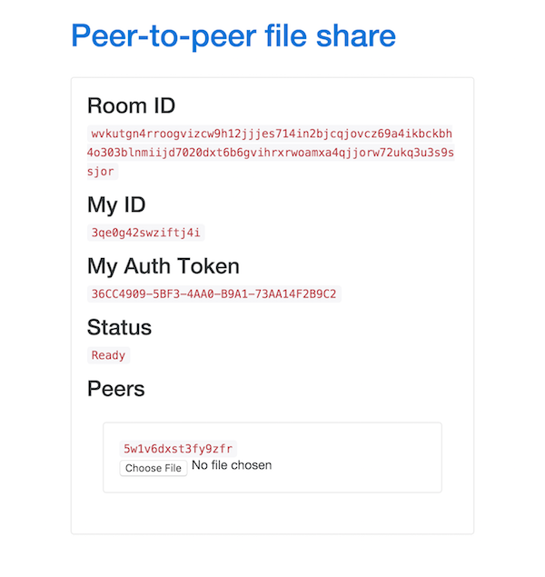

# Peer-to-Peer file sharing over Respoke DirectConnection (RTCDataChannel)



## Requirements

- node.js 0.12+ and npm
- nodemon: `npm install -g nodemon`
- [Respoke](https://portal.respoke.io) app ID, app secret, and role ID added to `./config/`

## Running it

```bash
git clone https://github.com/respoke/peer-to-peer-fileshare
cd peer-to-peer-fileshare
npm install
npm start
```

Go to http://localhost:3000

## File transfer example code

The file [views/room.jade](views/room.jade) shows how the file transfer is performed.
